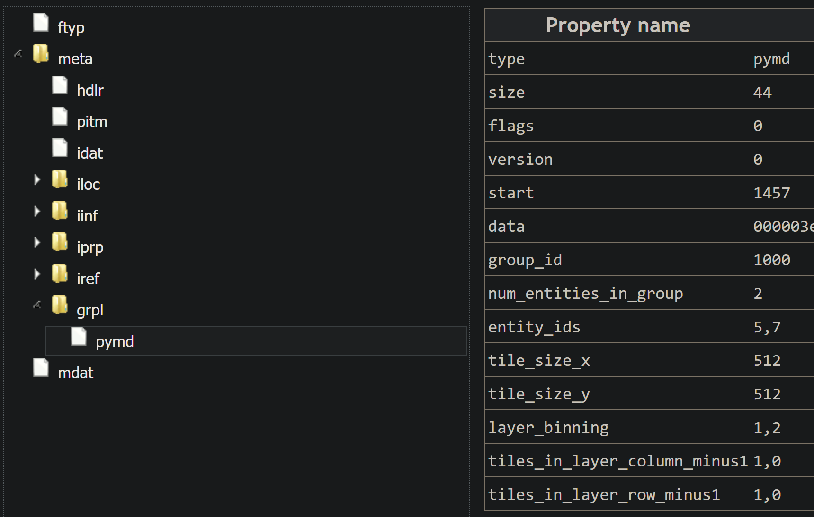
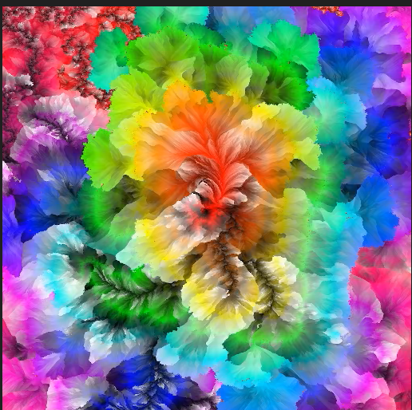

# pymd_hevc.md

## Details

- Contains an image pyramid with only 2 layers.
- The tile size for each layer is 512x512
- The base layer is 1024x1024
- Generated with this [libheif branch](https://github.com/dukesook/libheif/tree/ImagePyramid2) and [use_libheif branch](https://github.com/dukesook/use_libheif/tree/ImagePyramid2)

## hevc_binning_1.heif

- An standard grid image of the base layer for debugging purposes
- Full Size: 1024x1024
- Tile Size: 512x512
- Number of Rows: 2
- Number of Columns: 2

## hevc_binning_2.heif

- An standard grid image of the second layer for debugging purposes
- Full Size: 512x512
- Tile Size: 512x512
- Number of Rows: 1
- Number of Columns: 1

## MP4Box.js output

## preview.png

