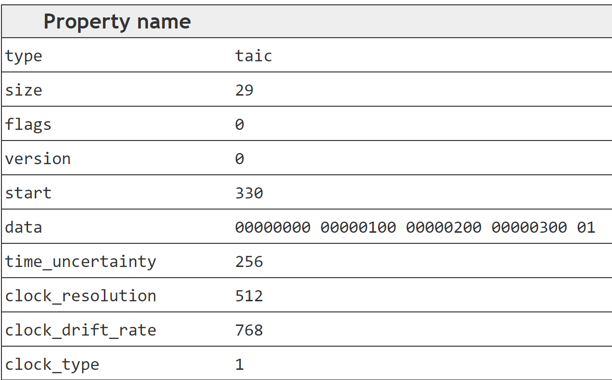
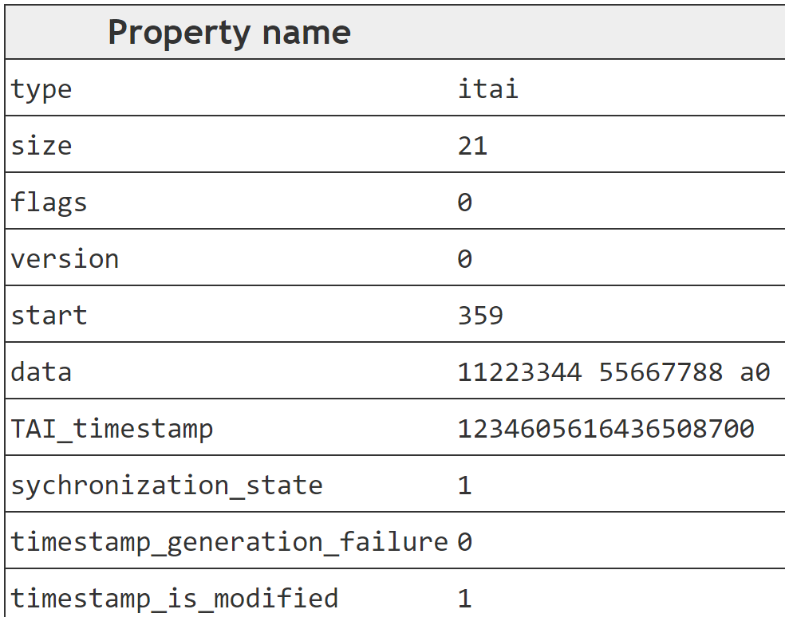

# Timestamps.heif

See draft amendment (DAM1) on high precision time tagging for ISO/IEC 23001-17

## 'taic' - TAIClockInfoBox

```C++
aligned(8) class TAIClockInfoBox extends FullBox('taic', 0, 0) {
  unsigned int(64) time_uncertainty;
  unsigned int(32) clock_resolution;
  signed int(32) clock_drift_rate;
  unsigned int(2) clock_type;
  unsigned int(6) reserved = 0;
}
```

## 'itai' - TAITimestampBox

```C++
aligned(8) class TAITimestampBox extends ItemFullProperty('itai', 0, 0) {
	TAITimestampPacket timestamp_packet;
}
```

## class TAITimestampPacket

```C++
aligned(8) class TAITimestampPacket {
  unsigned int(64) TAI_timestamp;
  unsigned int(1) synchronization_state;
  unsigned int(1) timestamp_generation_failure;
  unsigned int(1) timestamp_is_modified;
  unsigned int(5) reserved = 0;
}
```

## Expected Values

- taic
  - time_uncertainty: 256 = 0x100
  - clock_resolution: 512 = 0x200
  - clock_drift_rate: 768 = 0x300
  - clock_type: 1
- itai
  - TAI_timestamp: 1234605616436508552 = 0x0x1122334455667788
  - sychronization_state: 1
  - timestamp_generation_failure: 0
  - timestamp_is_modified: 1

## MP4Box.js

Verify with my MP4Box.js [branch](https://github.com/dukesook/mp4box.js/tree/timestamp_boxes.) & pull Request [here](https://github.com/gpac/mp4box.js/pull/366).




